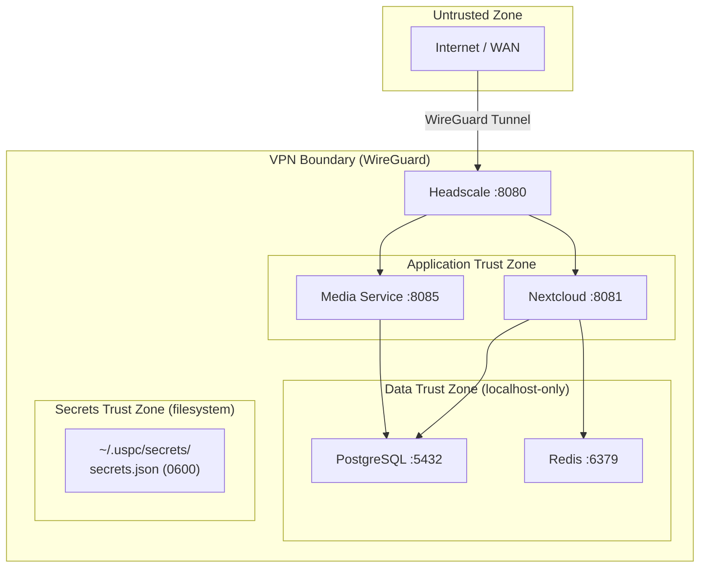

# USPC Security

> Version 0.1.0 | Module: `src/cloudctl/core/security.py`, `src/media/auth.py`

## Threat Model

### Trust Boundaries


### Threat Categories Addressed
1. **Unauthorized access**: HMAC-SHA256 token authentication with constant-time verification.
2. **Path traversal**: `validate_file_access()` resolves and checks paths against base directory.
3. **IDOR attacks**: Token binds user_id + item_id + expiry with HMAC signature.
4. **Brute force / DoS**: Sliding-window per-IP rate limiting (default 600 RPM).
5. **Secret exposure**: Structured logging masks all registered secrets. No secrets in Git (Trufflehog CI).
6. **Privilege escalation**: Rootless container execution by default.
7. **Supply chain**: SBOM generation, pip-audit vulnerability scanning, Bandit static analysis.
8. **Tar-slip**: Safe tar extraction with member path validation in migration import.

---

## Authentication

### HMAC-SHA256 Token System (`src/media/auth.py`)

**Token format**: `{user_id}:{expiry_unix}:{hmac_sha256_signature}`

**Creation** (`create_media_token()`):
```python
msg = f"{user_id}:{item_id}:{expiry}"
sig = hmac.new(secret, msg, "sha256").hexdigest()
token = f"{user_id}:{expiry}:{sig}"
```

**Verification** (`verify_media_token_user()`):
1. Parse token into `user_id`, `expiry`, `signature`.
2. Check token not in revocation registry.
3. Verify expiry timestamp (with optional clock skew tolerance).
4. Reconstruct expected HMAC signature.
5. **Constant-time comparison**: `hmac.compare_digest(sig, expected_sig)`.
6. Return `(True, user_id)` on match.

**Token revocation**: In-memory set `_REVOKED_TOKENS`. Call `revoke_token(token)` to revoke.

**Authentication flow**: Bearer header or `?token=` query parameter → `authenticate_request()`.

---

## Security Headers

Applied via HTTP middleware on every response (`src/media/app.py`):

| Header | Value |
|---|---|
| `Content-Security-Policy` | `default-src 'self'; script-src 'self'; style-src 'self' 'unsafe-inline'; img-src 'self' data: blob:; media-src 'self' blob:; frame-ancestors 'none'` |
| `X-Frame-Options` | `DENY` |
| `X-Content-Type-Options` | `nosniff` |
| `Strict-Transport-Security` | `max-age=31536000; includeSubDomains` |
| `Referrer-Policy` | `strict-origin-when-cross-origin` |
| `Permissions-Policy` | `camera=(), microphone=(), geolocation=()` |
| `X-Process-Time-Ms` | Measured request processing time |
| `Cache-Control` | `no-store` (on API responses) |

---

## Secret Management (`src/cloudctl/core/secrets.py`)

**7 generated credentials** (`CloudSecrets` dataclass):
1. `postgres_password` — 32-char secure password
2. `nextcloud_admin_password` — 32-char secure password
3. `redis_password` — 32-char secure password
4. `restic_password` — 32-char secure password
5. `media_jwt_secret` — 64-char hex token
6. `headscale_private_key` — 32-byte base64 key
7. `headscale_noise_private_key` — 32-byte base64 key

**Storage**: `~/.uspc/secrets/secrets.json`
- Directory permissions: `0700`
- File permissions: `0600`
- Atomic writes via temp file + rename

**Log masking**: All secret values registered via `register_secret_for_masking()` — replaced with `***` in log output.

---

## Security Audit Checks (`cloudctl security-check`)

| Check | What It Validates |
|---|---|
| Secrets Storage Permissions | `~/.uspc/secrets/` is 0700, files are 0600 |
| Network Isolation & Port Exposure | DB/Redis not publicly bound in private mode |
| Credential Strength | Admin username is not `root`/`administrator` |
| Container Privilege Isolation | `runtime.rootless: true` is set |
| Backup Encryption & Resilience | `backup.enabled: true` with Restic AES-256 |
| TLS Encryption | TLS enabled when public mode is active |

---

## CI/CD Security Pipeline (`.github/workflows/security.yml`)

1. **Bandit**: Static analysis (`bandit -r src/ -ll -ii`).
2. **pip-audit**: Dependency vulnerability scanning.
3. **Trufflehog**: Committed secret detection (`--only-verified`).
4. **SBOM Generation**: SPDX 2.3 + CycloneDX 1.5.
5. **License Audit**: `cloudctl sbom --audit` — 100% FOSS verification.

Runs on: push to `main`, pull requests, weekly schedule (Sunday 00:00).

---

## Exposed Ports

See [Architecture — Ports & Protocols](ARCHITECTURE.md#ports--protocols). In private mode (default), only the Headscale VPN control port is externally reachable.

---

## Security Incident Procedures

1. **Compromised token**: `revoke_token(token)` immediately, rotate `media_jwt_secret`.
2. **Compromised secrets**: `cloudctl init --force` to regenerate all secrets, restart services.
3. **Unauthorized access**: Check audit logs (`SECURITY_AUDIT:` prefix), review `cloudctl logs`.
4. **Vulnerability found**: Run `pip-audit`, update dependencies, run `cloudctl security-check --strict`.

---

## Cross-References

- [Architecture](ARCHITECTURE.md) | [Networking](NETWORKING.md) | [Configuration](CONFIGURATION.md)
- [Backup & DR](BACKUP-DR.md) | [Acceptance](ACCEPTANCE.md)
