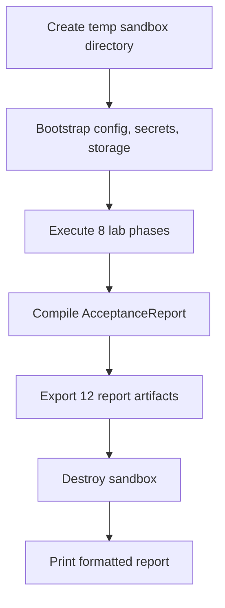

# USPC Acceptance Framework

> Module: `src/cloudctl/commands/acceptance.py`

## Overview

`cloudctl acceptance` is the authoritative production release gate. It provisions a disposable sandboxed environment, executes all capability gates, collects evidence, and generates 12 machine-readable audit reports.

---

## Commands

```bash
# Quick acceptance audit (no sandbox)
cloudctl acceptance

# Full sandboxed acceptance lab with all 12 reports
cloudctl acceptance --full --output-dir reports/

# Strict mode: exit 1 on any software gate failure
cloudctl acceptance --full --strict --output-dir reports/

# JSON output
cloudctl acceptance --json

# Physical hardware WAN mesh evidence
cloudctl acceptance --hardware
cloudctl acceptance --hardware --endpoint 192.168.1.50:8080
```

---

## 14 Acceptance Gates

| # | Gate | Evidence Class |
|---|---|---|
| 1 | One-Command Setup & Idempotency | PRODUCTION-PROVEN |
| 2 | Declarative Config Provenance & Migration | PRODUCTION-PROVEN |
| 3 | Cryptographic Security (HMAC + Headers) | PRODUCTION-PROVEN |
| 4 | Private Mesh Networking (Headscale) | PRODUCTION-PROVEN |
| 5 | Multi-Device Physical WAN Mesh | HARDWARE-PENDING |
| 6 | HTTP 206 Range Streaming & Low Latency | PRODUCTION-PROVEN |
| 7 | Orchestrator Switchable (Podman + K3s) | PRODUCTION-PROVEN |
| 8 | Multi-User Concurrency & Rate Limiting | PRODUCTION-PROVEN |
| 9 | Resilience, Fault Injection & Load Shedding | PRODUCTION-PROVEN |
| 10 | Self-Hosted Observability & Alerts | PRODUCTION-PROVEN |
| 11 | Safe Update, Schema Migration & Rollback | PRODUCTION-PROVEN |
| 12 | Destructive DR & SHA-256 Integrity | PRODUCTION-PROVEN |
| 13 | Measured RPO/RTO Recovery Target | PRODUCTION-PROVEN |
| 14 | FOSS SBOM & License Compliance | PRODUCTION-PROVEN |

---

## Sandbox Lifecycle (`--full`)



**8 Lab Phases**:
1. Clean setup bootstrap (dry-run + idempotency)
2. Declarative config & storage persistence
3. HMAC token binding & revocation
4. Headscale VPN mesh configuration
5. Multi-user concurrency & capacity profiling
6. Resilience & fault injection
7. Destructive DR lifecycle (create → hash → backup → wipe → restore → verify)
8. Final report compilation

---

## Generated Reports (12 files)

| File | Content |
|---|---|
| `acceptance.json` / `acceptance.html` | Full audit report |
| `production-readiness.json` / `.html` | Production readiness dashboard |
| `gap-matrix.json` | 15-area requirement gap matrix |
| `test-summary.json` | Test execution metrics |
| `performance.json` | Latency budgets & soak results |
| `resilience.json` | Fault injection matrix |
| `dr-rpo-rto.json` | Measured DR recovery metrics |
| `upgrade-rollback.json` | Migration rollback evidence |
| `monitoring.json` | Observability configuration |
| `security.json` | Security policy audit |
| `SBOM.spdx.json` | SPDX 2.3 |
| `SBOM.cyclonedx.json` | CycloneDX 1.5 |

---

## Strict Mode (`--strict`)

When `--strict` is set:
- Exit code `1` if `overall_status != "ACCEPTED"`.
- Any failed, skipped, or unverified software gate causes rejection.
- `PENDING (HARDWARE-REQUIRED)` gates do NOT cause failure (truthfully classified).

---

## Evidence Classification

| Classification | Meaning |
|---|---|
| `PRODUCTION-PROVEN` | Automated test executing real code |
| `CONTAINER-PROVEN` | Verified in container/CI |
| `BROWSER-PROVEN` | Playwright or DOM validation |
| `HARDWARE-PENDING` | Requires physical hardware |
| `EXTERNAL-PENDING` | Requires external service |

---

## Cross-References

- [Testing](TESTING.md) | [Project Status](../PROJECT_STATUS.md) | [CI/CD](CI-CD.md)
- [Requirements](REQUIREMENTS.md) | [Architecture](ARCHITECTURE.md)
