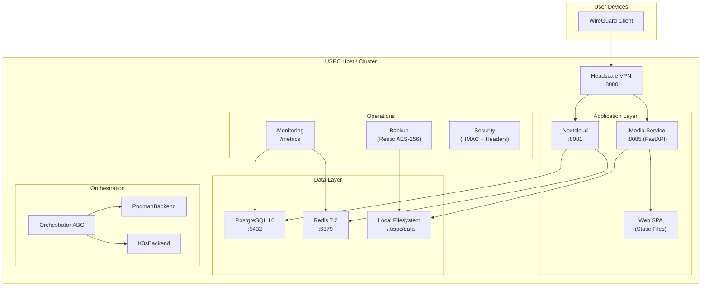
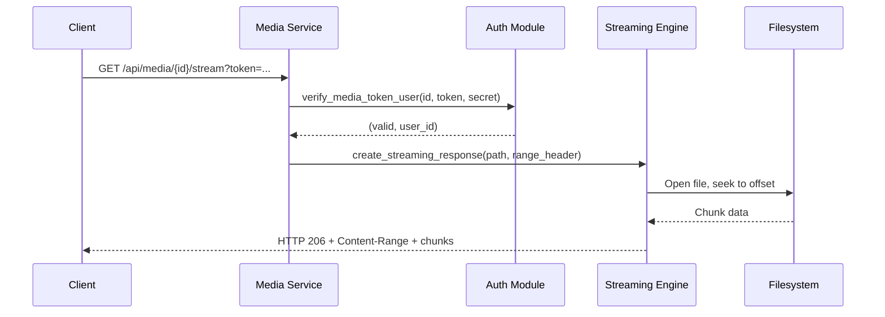
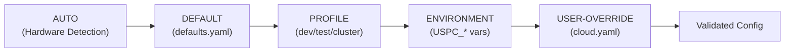

# USPC Architecture

> Version 0.1.0 | Last verified: 2026-08-17

## System Overview

USPC (Universal Personal Cloud Platform) is a self-hosted personal cloud that deploys Nextcloud, PostgreSQL, Redis, a custom media streaming service, and Headscale VPN networking on a single machine (Appliance Mode) or across multiple nodes (Cluster Mode).

---

## Component Responsibilities

### cloudctl CLI (`src/cloudctl/cli.py`)
Central command dispatcher. Parses arguments via `argparse`, dispatches to command modules. Provides `--config`, `--log-level`, `--json` global flags. Entry point: `cloudctl.cli:main`.

**Commands** (26 total): `setup`, `init`, `install`, `start`, `stop`, `restart`, `status`, `doctor`, `update`, `backup`, `restore`, `migrate`, `uninstall`, `cleanup`, `logs`, `security-check`, `test`, `performance`, `benchmark`, `bundle`, `config`, `readiness`, `acceptance`, `orchestrator`, `monitor`, `alerts`, `sbom`.

### Core Modules (`src/cloudctl/core/`)

| Module | Responsibility |
|---|---|
| `config.py` | `ConfigManager`: load/validate/merge/diff/export/import/migrate YAML configs against JSON Schema |
| `detect.py` | Host OS, CPU, RAM, disk, kernel, virtualization, container runtime detection |
| `secrets.py` | `SecretManager`: generate, store (0600), load, and mask 7 credential types |
| `storage.py` | `StorageManager`: initialize directory hierarchy, verify capacity, usage stats |
| `container.py` | `ContainerManager`: Podman/Docker container lifecycle (create, start, stop, exec, logs) |
| `orchestrator.py` | `Orchestrator` ABC + `create_orchestrator()` factory |
| `backup.py` | `BackupManager`: Restic init/backup/restore/verify/prune/RPO/RTO |
| `network.py` | `NetworkManager`: Headscale config generation, port matrix, VPN client enrollment, WAN probing |
| `security.py` | `SecurityChecker`: 6 audit checks (secrets perms, ports, passwords, privileges, backup encryption, TLS) |
| `metrics.py` | `MetricsStore` (SQLite time-series), `MetricSnapshot`, Prometheus exposition format |
| `health.py` | Service health checks, endpoint probing |
| `performance.py` | Hardware profiling, auto-tuning, benchmark runner, soak tests, load profiles |
| `migration.py` | Portable tar.gz bundle export/import with tar-slip protection |
| `reporting.py` | Structured report generation |
| `logging.py` | Structured logging with secret masking |

### Orchestrator Backends (`src/cloudctl/core/backends/`)

| Backend | Mode | Usage |
|---|---|---|
| `podman_backend.py` | Appliance (default) | Single-node rootless Podman/Docker. Creates containers with resource limits, health checks, restart policies. |
| `k3s_backend.py` | Cluster (optional) | Multi-node K3s. Applies Kustomize manifests from `deploy/k3s/`. Supports rolling updates, node management, replica scaling. |

### Media Service (`src/media/`)

| Module | Responsibility |
|---|---|
| `app.py` | FastAPI application factory. Routes: `/api/media`, `/api/upload`, `/api/scan`, `/api/stats`, `/health`, `/metrics`. Security middleware, rate limiting, CORS. |
| `auth.py` | HMAC-SHA256 token creation/verification, constant-time comparison, revocation registry, path traversal guard |
| `config.py` | `MediaConfig` dataclass: port, paths, limits, supported formats |
| `models.py` | `MediaDatabase` (SQLite): CRUD for media items with FTS search |
| `scanner.py` | Filesystem scanner with MIME detection and symlink protection |
| `indexer.py` | `MediaIndexer`: sync filesystem state to database |
| `streaming.py` | HTTP 206 chunked streaming with `Range` header parsing |
| `thumbnails.py` | Pillow/FFmpeg thumbnail generation and caching |
| `metadata.py` | Resolution, codec, duration, EXIF tag extraction |
| `transcoder.py` | FFmpeg-based format transcoding with timeout protection |
| `fairness.py` | `ConcurrencyManager`, `SlidingWindowRateLimiter`, `InFlightDeduplicator` |
| `worker.py` | `BackgroundWorker`: async task queue for indexing/transcoding |

---

## Data Flow

### Media Streaming Request

### Configuration Load

---

## Persistence

| Data | Location | Backup |
|---|---|---|
| User files & media | `~/.uspc/data/` | Restic encrypted snapshots |
| PostgreSQL database | Container volume / dump to `~/.uspc/config/postgres_backup.sql` | Included in Restic backup |
| Redis cache | Container volume (ephemeral) | Not backed up (cache) |
| Configuration | `config/cloud.yaml` | Included in Restic backup |
| Secrets | `~/.uspc/secrets/secrets.json` (0600) | Included in Restic backup |
| Metrics history | `~/.uspc/config/metrics.db` (SQLite) | Included in Restic backup |
| Media metadata | `~/.uspc/data/media.db` (SQLite) | Included in Restic backup |

---

## Ports & Protocols

| Port | Service | Protocol | Default Access |
|---|---|---|---|
| 5432 | PostgreSQL | TCP | localhost-only |
| 6379 | Redis | TCP | localhost-only |
| 8080 | Headscale VPN | TCP | vpn-only (or public in public mode) |
| 8081 | Nextcloud | TCP | vpn-only |
| 8085 | USPC Media Service | TCP | vpn-only |
| 80 | HTTP Proxy (public mode only) | TCP | public |
| 443 | HTTPS Proxy (public mode only) | TCP | public |
| 9090 | Prometheus (cluster mode) | TCP | localhost-only |
| 3000 | Grafana (cluster mode) | TCP | vpn-only |
| 3100 | Loki (cluster mode) | TCP | localhost-only |

---

## K3s Cluster Manifests (`deploy/k3s/`)

| File | Resource |
|---|---|
| `00-namespace.yaml` | `uspc` namespace |
| `01-storage-pvc.yaml` | PersistentVolumeClaims |
| `02-postgres.yaml` | PostgreSQL StatefulSet |
| `03-redis.yaml` | Redis Deployment |
| `04-nextcloud.yaml` | Nextcloud Deployment |
| `05-media-service.yaml` | USPC Media Service Deployment |
| `06-headscale.yaml` | Headscale VPN Deployment |
| `07-ingress.yaml` | Ingress rules |
| `08-monitoring-prometheus.yaml` | Prometheus server |
| `09-monitoring-grafana.yaml` | Grafana dashboards |
| `10-monitoring-loki.yaml` | Loki log aggregation |
| `11-monitoring-alertmanager.yaml` | Alertmanager |
| `kustomization.yaml` | Kustomize overlay |

---

## Cross-References

- [Requirements](REQUIREMENTS.md) | [Implementation](../IMPLEMENTATION.md) | [Configuration](CONFIGURATION.md)
- [Orchestration](ORCHESTRATION.md) | [Networking](NETWORKING.md) | [Monitoring](MONITORING.md)
- [Security](SECURITY.md) | [Backup & DR](BACKUP-DR.md)
