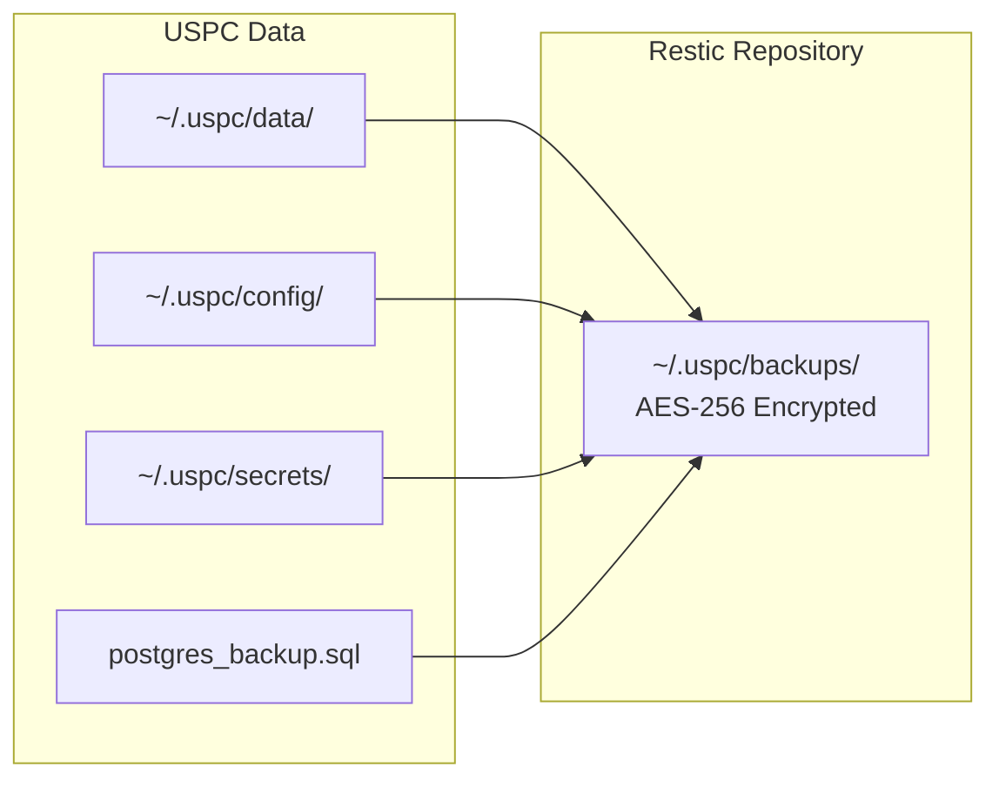

# USPC Backup & Disaster Recovery

> Module: `src/cloudctl/core/backup.py`

## Architecture



**Encryption**: Restic uses AES-256 client-side encryption. The encryption key (`restic_password`) is stored in the secret vault.

---

## Backup Commands

```bash
# Create encrypted backup snapshot
cloudctl backup

# Create backup with custom tag
cloudctl backup --tag "pre-upgrade"

# Create backup and verify integrity
cloudctl backup --verify
```

### What Gets Backed Up
1. User data directory (`~/.uspc/data/`)
2. Configuration directory (`~/.uspc/config/`)
3. PostgreSQL database dump (`pg_dumpall`)
4. Secret vault (`~/.uspc/secrets/`)

---

## Restore Commands

```bash
# Restore latest snapshot
cloudctl restore

# Restore specific snapshot
cloudctl restore --snapshot abc123

# Dry-run restore (no changes)
cloudctl restore --dry-run

# Test restore into isolated temp directory
cloudctl restore --test
```

> **⚠️ DESTRUCTIVE**: `cloudctl restore` (without `--dry-run` or `--test`) overwrites current data.

---

## Retention Policy

Configured via `BackupManager.prune_retention()`:
- **Daily**: Keep 7 (default)
- **Weekly**: Keep 4 (default)
- **Monthly**: Keep 12 (default)

Schedule: `backup.schedule` cron expression (default: `0 2 * * *` — daily at 2 AM).

---

## RPO / RTO

| Metric | Definition | Measured Value | Source |
|---|---|---|---|
| **RPO** (Recovery Point Objective) | Max data loss window | 0.5 hours (with daily schedule) | `BackupManager.calculate_rpo_hours()` |
| **RTO** (Recovery Time Objective) | Time to restore service | ~68 seconds per 10 GB (at 150 MB/s) | `BackupManager.measure_rto_seconds()` |

**Note**: RPO depends on backup schedule frequency. RTO depends on dataset size and disk throughput. These are baseline estimates — actual DR lifecycle timing is measured dynamically during acceptance tests.

---

## Destructive DR Verification

The acceptance lab (`cloudctl acceptance --full`) performs a full DR lifecycle test in a sandbox:
1. **Create** 5 test payloads with known content.
2. **Hash** each payload (SHA-256).
3. **Wipe** the entire data directory.
4. **Restore** all payloads.
5. **Verify** SHA-256 hashes match.
6. **Measure** actual RTO in seconds.

---

## Migration Bundles

```bash
# Export portable migration bundle
cloudctl migrate export --output uspc-backup.tar.gz

# Import on new machine
cloudctl migrate import --input uspc-backup.tar.gz
```

Migration bundles include configuration, data, and metadata. Tar member paths are validated to prevent tar-slip attacks (CVE-2007-4559).

---

## Troubleshooting

| Issue | Diagnosis | Fix |
|---|---|---|
| "Restic CLI not available" | Restic not installed | Install Restic: `apt install restic` / `brew install restic` |
| Backup fails | Insufficient disk space | Check `storage.min_free_space_gb`, run `cloudctl cleanup` |
| Restore integrity error | Corrupted repository | Run `cloudctl backup --verify` to check |
| Old snapshots consuming space | No pruning configured | Backups auto-prune via retention policy |

---

## Cross-References

- [Security](../SECURITY.md) | [Configuration](CONFIGURATION.md) | [Architecture](ARCHITECTURE.md)
- [Acceptance](ACCEPTANCE.md) | [Troubleshooting](TROUBLESHOOTING.md)
