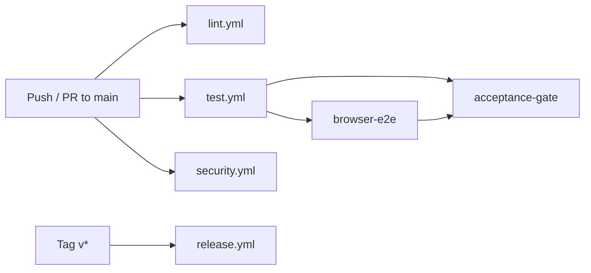

# USPC CI/CD Pipeline

> Workflows: `.github/workflows/`

## Pipeline Overview

---

## Workflows

### 1. Code Quality & Linting (`lint.yml`)
**Triggers**: Push/PR to `main`/`master`
- Ruff linter: `ruff check src/ tests/`
- Ruff formatter: `ruff format --check src/ tests/`

### 2. Automated Tests & Coverage (`test.yml`)
**Triggers**: Push/PR to `main`/`master`

**Jobs**:

| Job | Runs On | What It Does |
|---|---|---|
| `test` | ubuntu/windows/macos × Python 3.10/3.11/3.12 | Full pytest suite with coverage |
| `browser-e2e` | ubuntu-latest | Build & run Playwright container |
| `acceptance-gate` | ubuntu-latest (after test + e2e) | `cloudctl acceptance --full --output-dir reports/` |

**Quality gates**:
- `pytest --cov=src --cov-report=term-missing --cov-report=xml`
- `coverage report --fail-under=95` (Linux only)
- Acceptance evidence artifacts uploaded

### 3. Security & Vulnerability Scan (`security.yml`)
**Triggers**: Push/PR to `main`/`master`, weekly schedule (Sunday)

**Steps**:
1. Bandit static analysis: `bandit -r src/ -ll -ii`
2. pip-audit dependency vulnerability scan
3. Trufflehog committed secret detection
4. SBOM generation (SPDX + CycloneDX)
5. License compliance audit: `cloudctl sbom --audit`

### 4. Build & Release (`release.yml`)
**Triggers**: Push of `v*` tags

**Steps**:
1. Build offline bundle: `cloudctl bundle create`
2. Generate SBOMs (SPDX + CycloneDX)
3. SHA-256 checksums
4. Create GitHub Release with all artifacts

---

## Artifacts

| Artifact | Source |
|---|---|
| `coverage-report` (coverage.xml) | `test.yml` |
| `acceptance-evidence` (reports/) | `test.yml` |
| `security-sbom-reports` (reports/) | `security.yml` |
| `dist/*` + SHA256SUMS | `release.yml` |

---

## Cross-References

- [Testing](TESTING.md) | [Acceptance](ACCEPTANCE.md) | [SBOM & License](SBOM-LICENSE.md)
