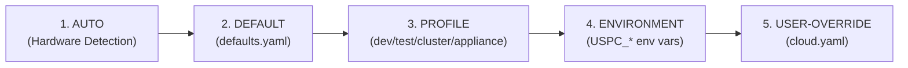

# USPC Configuration Reference

> Version 0.1.0 | Schema: `config/schema.yaml` | Defaults: `config/defaults.yaml`

## Configuration Precedence

USPC applies a deterministic 5-stage precedence (lowest → highest priority):



---

## Configuration Files

| File | Purpose |
|---|---|
| `config/schema.yaml` | JSON Schema (Draft-07) defining all valid settings, types, ranges |
| `config/defaults.yaml` | Base default values for all settings |
| `config/cloud.yaml` | User overrides (highest priority) |
| `config/cloud.example.yaml` | Annotated example configuration |

---

## Complete Settings Reference

### `cloud` (required)

| Key | Type | Default | Valid Values | Security Impact | Restart Required |
|---|---|---|---|---|---|
| `cloud.name` | string | `"mycloud"` | 3-32 chars `[a-zA-Z0-9_-]` | No | No |
| `cloud.environment` | enum | `"production"` | `production`, `development`, `testing` | No | No |
| `cloud.domain` | string | `"mycloud.local"` | Any valid FQDN/hostname | No | Yes |
| `cloud.admin_user` | string | `"admin"` | 3-64 chars `[a-zA-Z0-9_.@-]` | Yes | No |
| `cloud.admin_email` | string | — | Valid email | No | No |

### `orchestrator`

| Key | Type | Default | Valid Values | Security Impact | Restart Required |
|---|---|---|---|---|---|
| `orchestrator.mode` | enum | `"appliance"` | `appliance`, `cluster`, `k3s` | No | Yes |
| `orchestrator.namespace` | string | `"uspc"` | Any valid K8s namespace | No | Yes |
| `orchestrator.k3s_version` | string | `"v1.30.2+k3s1"` | Valid K3s version | No | Yes |
| `orchestrator.node_role` | enum | `"server"` | `server`, `agent`, `standalone` | No | Yes |
| `orchestrator.scaling_policy` | enum | `"manual"` | `manual`, `auto` | No | No |

### `runtime`

| Key | Type | Default | Valid Values | Security Impact | Restart Required |
|---|---|---|---|---|---|
| `runtime.engine` | enum | `"auto"` | `auto`, `podman`, `docker` | No | Yes |
| `runtime.rootless` | boolean | `true` | `true`, `false` | **Yes** | Yes |
| `runtime.vm_memory_mb` | integer | `4096` | ≥ 2048 | No | Yes |
| `runtime.vm_cpus` | integer | `2` | ≥ 1 | No | Yes |

### `storage` (required)

| Key | Type | Default | Valid Values | Security Impact | Restart Required |
|---|---|---|---|---|---|
| `storage.data_path` | string | `"~/.uspc/data"` | Any writable path | No | Yes |
| `storage.config_path` | string | `"~/.uspc/config"` | Any writable path | No | Yes |
| `storage.min_free_space_gb` | number | `20` | ≥ 0.1 | No | No |
| `storage.profile` | enum | `"local"` | `local`, `nfs`, `smb`, `distributed` | No | Yes |
| `storage.ha_mode` | enum | `"none"` | `none`, `replication`, `distributed` | No | Yes |

### `performance`

| Key | Type | Default | Valid Values | Security Impact | Restart Required |
|---|---|---|---|---|---|
| `performance.profile` | enum | `"auto"` | `auto`, `tiny`, `small`, `standard`, `performance`, `media` | No | No |
| `performance.auto_tune` | boolean | `true` | — | No | No |
| `performance.max_concurrent_streams` | integer | `10` | 1 – 1000 | No | No |
| `performance.max_streams_per_user` | integer | `3` | 1 – 50 | No | No |
| `performance.max_transcode_concurrency` | integer | `2` | 0 – 16 | No | No |
| `performance.rate_limit_requests_per_minute` | integer | `600` | 10 – 10000 | No | No |
| `performance.db_connection_pool_size` | integer | `20` | 5 – 200 | No | Yes |

#### `performance.budgets`

| Key | Type | Default | Description |
|---|---|---|---|
| `budgets.max_listing_p95_ms` | number | `50` | Max listing API P95 latency |
| `budgets.max_stream_start_p95_ms` | number | `100` | Max media stream start P95 |
| `budgets.max_api_p99_ms` | number | `200` | Max API P99 latency |
| `budgets.max_startup_seconds` | number | `30` | Max service startup time |
| `budgets.max_concurrent_users` | integer | `50` | Max simultaneous users |
| `budgets.min_upload_throughput_mb_s` | number | `10` | Min upload throughput |

### `monitoring`

| Key | Type | Default | Valid Values | Security Impact | Restart Required |
|---|---|---|---|---|---|
| `monitoring.enabled` | boolean | `true` | — | No | No |
| `monitoring.profile` | enum | `"minimal"` | `minimal`, `standard`, `full`, `cluster` | No | No |
| `monitoring.prometheus_port` | integer | `9090` | 1024 – 65535 | No | Yes |
| `monitoring.grafana_port` | integer | `3000` | 1024 – 65535 | No | Yes |
| `monitoring.loki_port` | integer | `3100` | 1024 – 65535 | No | Yes |
| `monitoring.scrape_interval_seconds` | integer | `15` | 1 – 3600 | No | No |
| `monitoring.alert_evaluation_interval_seconds` | integer | `60` | 1 – 3600 | No | No |
| `monitoring.metrics_retention_days` | integer | `30` | 1 – 365 | No | No |
| `monitoring.metrics_max_size_mb` | integer | `100` | 10 – 10000 | No | No |
| `monitoring.alert_cpu_threshold` | number | `85` | 10 – 100 | No | No |
| `monitoring.alert_ram_threshold` | number | `90` | 10 – 100 | No | No |
| `monitoring.alert_disk_threshold` | number | `90` | 10 – 100 | No | No |

### `network` (required)

| Key | Type | Default | Valid Values | Security Impact | Restart Required |
|---|---|---|---|---|---|
| `network.mode` | enum | `"private"` | `private`, `public` | **Yes** | Yes |
| `network.vpn_subnet` | string | `"100.64.0.0/10"` | Valid CIDR | **Yes** | Yes |
| `network.headscale_port` | integer | `8080` | 1024 – 65535 | **Yes** | Yes |
| `network.public_http_port` | integer | `80` | 80 – 65535 | No | Yes |
| `network.public_https_port` | integer | `443` | 443 – 65535 | No | Yes |
| `network.enable_magic_dns` | boolean | `true` | — | No | Yes |

### `services` (required)

| Key | Type | Default |
|---|---|---|
| `services.nextcloud.version` | string | `"27.1.4-apache"` |
| `services.nextcloud.port` | integer | `8081` |
| `services.nextcloud.memory_limit` | string | `"1024M"` |
| `services.nextcloud.upload_max_filesize` | string | `"16G"` |
| `services.postgres.version` | string | `"16.1-alpine"` |
| `services.postgres.port` | integer | `5432` |
| `services.postgres.db_name` | string | `"nextcloud"` |
| `services.postgres.user` | string | `"nextcloud"` |
| `services.redis.version` | string | `"7.2-alpine"` |
| `services.redis.port` | integer | `6379` |

### `media` (required)

| Key | Type | Default | Valid Values |
|---|---|---|---|
| `media.enabled` | boolean | `true` | — |
| `media.port` | integer | `8085` | — |
| `media.thumbnail_width` | integer | `320` | 64 – 1024 |
| `media.preview_width` | integer | `800` | 320 – 3840 |
| `media.max_transcode_jobs` | integer | `2` | 1 – 16 |
| `media.chunk_size_kb` | integer | `64` | 16 – 4096 |
| `media.background_processing` | boolean | `true` | — |
| `media.index_on_upload` | boolean | `true` | — |
| `media.supported_video` | array | `[mp4, webm, mov, mkv, avi, wmv, flv]` | — |
| `media.supported_audio` | array | `[mp3, aac, m4a, flac, ogg, opus, wav, wma]` | — |
| `media.supported_image` | array | `[jpg, jpeg, png, webp, gif, bmp, svg, tiff]` | — |

### `backup` (required)

| Key | Type | Default | Valid Values |
|---|---|---|---|
| `backup.enabled` | boolean | `true` | — |
| `backup.target_type` | enum | `"local"` | `local`, `external`, `sftp` |
| `backup.target_path` | string | `"~/.uspc/backups"` | Any writable path |
| `backup.retention_days` | integer | `30` | ≥ 1 |
| `backup.schedule` | string | `"0 2 * * *"` | Valid cron expression |
| `backup.verify_after_backup` | boolean | `true` | — |

### `security` (required)

| Key | Type | Default | Security Impact |
|---|---|---|---|
| `security.enforce_mfa` | boolean | `false` | **Yes** |
| `security.auto_security_updates` | boolean | `true` | **Yes** |
| `security.firewall_enabled` | boolean | `true` | **Yes** |
| `security.tls_enabled` | boolean | `false` | **Yes** |

---

## Environment Variable Overrides

| Variable | Maps To | Example |
|---|---|---|
| `USPC_ORCHESTRATOR_MODE` | `orchestrator.mode` | `USPC_ORCHESTRATOR_MODE=cluster` |
| `USPC_ENVIRONMENT` | `cloud.environment` | `USPC_ENVIRONMENT=development` |
| `USPC_DATA_PATH` | `storage.data_path` | `USPC_DATA_PATH=/mnt/data` |
| `USPC_MONITORING_PROFILE` | `monitoring.profile` | `USPC_MONITORING_PROFILE=full` |
| `USPC_STORAGE_PROFILE` | `storage.profile` | `USPC_STORAGE_PROFILE=nfs` |

---

## CLI Config Commands

```bash
# Validate configuration against schema
cloudctl config validate

# Show all settings with provenance (AUTO/DEFAULT/USER-OVERRIDE)
cloudctl config diff

# Export active config (secrets masked by default)
cloudctl config export
cloudctl config export --unmask-secrets    # ⚠️ CAUTION: exposes secrets

# Import configuration from file (backs up existing config first)
cloudctl config import --input /path/to/new-cloud.yaml

# Migrate configuration schema to newer version
cloudctl config migrate --target-version 0.3.0
```

---

## Cross-References

- [Architecture](ARCHITECTURE.md) | [Requirements](REQUIREMENTS.md) | [Setup Guides](setup/)
- [Security](../SECURITY.md) | [Monitoring](MONITORING.md) | [Performance](PERFORMANCE.md)
