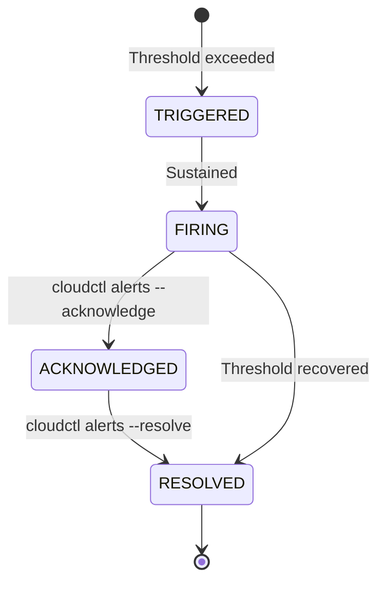

# USPC Monitoring & Observability

> Modules: `src/cloudctl/core/metrics.py`, `src/cloudctl/commands/monitor.py`, `src/cloudctl/commands/alerts.py`

## Monitoring Profiles

| Profile | Components | Use Case |
|---|---|---|
| `minimal` (default) | SQLite metrics store, CLI dashboard | Single laptop, minimal overhead |
| `standard` | + Prometheus `/metrics` endpoint | Production single-node |
| `full` | + Grafana dashboards, Loki logs | Production with visualization |
| `cluster` | + Alertmanager, multi-node | K3s cluster deployments |

Configure via: `monitoring.profile` in `config/cloud.yaml` or `--profile` CLI flag.

---

## Metrics Collected (`MetricSnapshot`)

| Metric | Prometheus Name | Description |
|---|---|---|
| CPU % | `uspc_cpu_percent` | System CPU utilization |
| RAM % | `uspc_ram_percent` | System RAM utilization |
| Disk Free GB | `uspc_disk_free_gigabytes` | Available disk space |
| Active Streams | `uspc_active_streams` | Current media streaming sessions |
| Queue Depth | `uspc_queue_depth` | Pending background tasks |
| Error Count | `uspc_error_count` | Error counter |
| IO Read MB | `uspc_io_read_megabytes` | Disk read throughput |
| IO Write MB | `uspc_io_write_megabytes` | Disk write throughput |
| Net Sent MB | `uspc_net_sent_megabytes` | Network egress |
| Net Recv MB | `uspc_net_recv_megabytes` | Network ingress |
| Latency P95 ms | `uspc_latency_p95_ms` | API response P95 latency |

---

## CLI Commands

```bash
# Live terminal dashboard (1 sample)
cloudctl monitor

# Continuous monitoring (10 samples, 5s interval)
cloudctl monitor --count 10 --interval 5

# Prometheus exposition format
cloudctl monitor --prometheus

# JSON output
cloudctl monitor --json

# Full profile with all metrics
cloudctl monitor --profile full
```

---

## Alert System

### Default Thresholds

| Alert | Default Threshold | Severity |
|---|---|---|
| CPU | > 85% | WARNING (> 95% CRITICAL) |
| RAM | > 90% | WARNING (> 95% CRITICAL) |
| Disk | < 10% free | WARNING (< 5% CRITICAL) |
| Error spike | > 10 errors/minute | WARNING |

### Alert Lifecycle



### Alert Commands
```bash
# View active alerts
cloudctl alerts

# Fail CI on critical alerts
cloudctl alerts --fail-on-critical

# Simulate alert lifecycle
cloudctl alerts --simulate-cycle

# Acknowledge/resolve
cloudctl alerts --acknowledge ALT-1001
cloudctl alerts --resolve ALT-1001
```

---

## Metrics Storage

**SQLite time-series store** (`MetricsStore`):
- Location: `~/.uspc/config/metrics.db`
- Auto-pruning: configurable retention (default 30 days, max 100 MB)
- Historical summary queries with configurable time windows

---

## K3s Monitoring Stack

In cluster mode, deploy via Kustomize:

| Component | Manifest | Port |
|---|---|---|
| Prometheus | `08-monitoring-prometheus.yaml` | 9090 |
| Grafana | `09-monitoring-grafana.yaml` | 3000 |
| Loki | `10-monitoring-loki.yaml` | 3100 |
| Alertmanager | `11-monitoring-alertmanager.yaml` | 9093 |

```bash
# Apply monitoring stack
kubectl apply -k deploy/k3s/
```

---

## Cross-References

- [Configuration](CONFIGURATION.md) | [Architecture](ARCHITECTURE.md) | [Orchestration](ORCHESTRATION.md)
- [Performance](PERFORMANCE.md) | [Troubleshooting](TROUBLESHOOTING.md)
