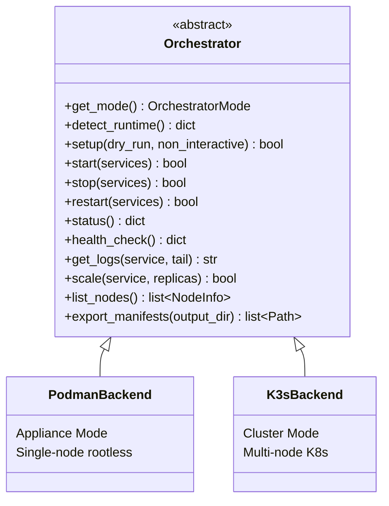

# USPC Orchestration

> Module: `src/cloudctl/core/orchestrator.py`, `src/cloudctl/core/backends/`

## Why Podman is the Default

USPC targets personal cloud deployment on a single machine. Podman provides:
- **Rootless execution**: No daemon, no root privileges required.
- **Docker compatibility**: Same CLI and image format.
- **Simplicity**: No cluster overhead for single-node deployments.
- **Cross-platform**: Works on Linux (native), Windows (WSL2/Podman Machine), macOS (Podman Machine).

---

## When to Use K3s

Switch to K3s Cluster Mode when:
- You have **2+ physical/virtual nodes**.
- You need **rolling updates** without downtime.
- You need **horizontal pod autoscaling**.
- You want **declarative Kubernetes manifests**.

---

## Architecture



**Factory**: `create_orchestrator(config)` reads `orchestrator.mode` and returns the appropriate backend.

---

## Switching Modes

```bash
# Check current mode
cloudctl orchestrator status

# Switch to cluster mode
cloudctl orchestrator switch cluster

# Switch back to appliance mode
cloudctl orchestrator switch appliance

# List nodes
cloudctl orchestrator nodes --json

# Scale a service (cluster mode only)
cloudctl orchestrator scale media-service 3

# Export manifests
cloudctl orchestrator manifests --output-dir deploy/manifests_export/
```

**Data safety**: Switching modes does not delete user data. Storage paths remain unchanged. Configuration is updated in `cloud.yaml`.

---

## K3s Manifests (`deploy/k3s/`)

Applied via Kustomize (`kustomization.yaml`):

| Order | File | Resource |
|---|---|---|
| 0 | `00-namespace.yaml` | `uspc` namespace |
| 1 | `01-storage-pvc.yaml` | PersistentVolumeClaims |
| 2 | `02-postgres.yaml` | PostgreSQL StatefulSet |
| 3 | `03-redis.yaml` | Redis Deployment |
| 4 | `04-nextcloud.yaml` | Nextcloud Deployment |
| 5 | `05-media-service.yaml` | Media Service Deployment |
| 6 | `06-headscale.yaml` | Headscale VPN Deployment |
| 7 | `07-ingress.yaml` | Ingress routing rules |
| 8 | `08-monitoring-prometheus.yaml` | Prometheus server |
| 9 | `09-monitoring-grafana.yaml` | Grafana dashboards |
| 10 | `10-monitoring-loki.yaml` | Loki log aggregation |
| 11 | `11-monitoring-alertmanager.yaml` | Alertmanager |

---

## Limitations

- **Appliance Mode**: No HA, no horizontal scaling. Service restart is the recovery mechanism.
- **K3s Mode**: Requires K3s binary installed. Node management is manual (`scaling_policy: manual`).
- **Switching**: Live migration of running containers between modes is not supported. Stop services first.

---

## Cross-References

- [Architecture](ARCHITECTURE.md) | [Configuration](CONFIGURATION.md) | [Monitoring](MONITORING.md)
