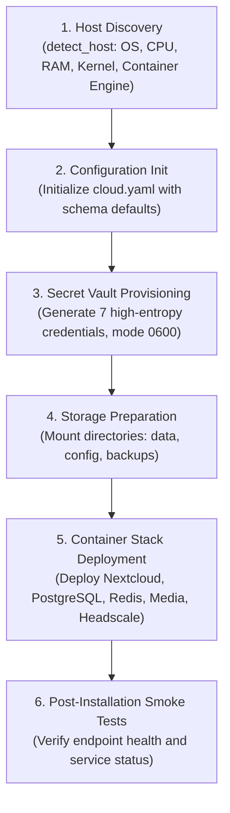

# USPC Installation & Setup Guide

> Comprehensive setup, bootstrap, and environment preparation guide for USPC.
> Command: `cloudctl setup` | Entry point: `src/cloudctl/commands/setup.py`

---

## 1. Quick Start (One-Command Bootstrap)

### Automated Platform Scripts

#### Windows (Podman + Dedicated Drive Partition Automation)
```powershell
# Automatically installs prerequisites (Podman, Python), configures partition, and bootstraps USPC:
powershell.exe -ExecutionPolicy Bypass -File .\scripts\setup-windows-podman.ps1 -StorageDrive "H:\USPC_STORAGE"
```

#### Linux (Podman + Dedicated Partition Automation)
```bash
# Automatically installs Podman, configures mount point, and bootstraps USPC:
./scripts/setup-linux-podman.sh /mnt/uspc_data
```

---

### Manual / Custom Bootstrap
```bash
# 1. Clone repository
git clone https://github.com/dayashimoga/USPC.git
cd USPC

# 2. Install Python runtime & package
pip install -e ".[dev]"

# 3. Execute automated setup (idempotent, reboot-safe)
cloudctl setup

# Or run non-interactive unattended setup (e.g., in CI or automation scripts):
cloudctl setup --non-interactive
```

---

## 2. Platform Prerequisites

### Linux (Ubuntu 22.04+, Debian 12+, Fedora 38+, Arch)
- **Container Runtime**: Podman (recommended, rootless) or Docker.
  - Install Podman: `sudo apt install -y podman` (Debian/Ubuntu) or `sudo dnf install -y podman` (Fedora).
- **Python**: Version ≥ 3.10.
- **Rootless User Setup**: Ensure user namespaces are enabled:
  ```bash
  # Check subuid/subgid
  grep $(whoami) /etc/subuid /etc/subgid
  ```

### Windows 10/11 + WSL2
- **WSL2**: Ensure WSL2 is installed: `wsl --install -d Ubuntu`.
- **Container Engine**: Docker Desktop with WSL2 backend integration, or Podman in WSL2.
- **Execution**: Run `cloudctl setup` inside your WSL2 Ubuntu terminal or PowerShell via `cloudctl.ps1`.

### macOS 13+ (Apple Silicon & Intel)
- **Container Engine**: Podman Machine (`brew install podman && podman machine init && podman machine start`) or Docker Desktop.
- **Python**: Version ≥ 3.10 via Homebrew: `brew install python@3.11`.

---

## 3. Bootstrap Lifecycle (`cloudctl setup`)

When `cloudctl setup` executes, it performs a 5-step idempotent bootstrap:



---

## 4. CLI Setup Options & Flags

| Flag | Type | Description |
|---|---|---|
| `--dry-run` | Flag | Simulate host discovery, storage planning, and config initialization without modifying the host system |
| `--non-interactive` | Flag | Run unattended without confirmation prompts (recommended for CI/CD and automated provisioning) |
| `--force, -f` | Flag | Overwrite existing configuration and regenerate secrets vault |
| `--name <name>` | String | Custom cloud instance identifier (3–32 alphanumeric characters) |
| `--domain <domain>` | String | Custom FQDN or private hostname for cloud instance (e.g., `cloud.example.com`) |
| `--skip-smoke-test` | Flag | Skip post-installation endpoint health checks |
| `--config, -c <path>` | String | Path to custom `cloud.yaml` configuration file |

### Example Invocations

```bash
# Preflight dry-run validation
cloudctl setup --dry-run

# Custom instance name and domain
cloudctl setup --name homecloud --domain mycloud.local --non-interactive

# Force re-initialization of configuration and secrets
cloudctl setup --force --non-interactive
```

---

## 5. Post-Installation Verification

Run the following diagnostic commands to confirm the health and production readiness of your installation:

```bash
# 1. Check container and service health status
cloudctl status

# 2. Run diagnostic doctor with automated remediation checks
cloudctl doctor

# 3. Evaluate full 7-layer production readiness compliance
cloudctl readiness

# 4. Execute authoritative 14-gate acceptance lab in sandbox
cloudctl acceptance --full --strict
```

---

## 6. Recovery & Troubleshooting

### Interrupted or Failed Setup
Because `cloudctl setup` is completely **idempotent**, simply re-run:
```bash
cloudctl setup --non-interactive
```
The engine will detect existing storage partitions, preserve existing secrets, and reconcile any missing containers or configuration files.

### Diagnostic Logs
Inspect logs using:
```bash
# General application logs
cloudctl logs --tail 100

# Service-specific logs
cloudctl logs --service nextcloud --tail 50
cloudctl logs --service media --tail 50
cloudctl logs --service headscale --tail 50
```

---

## 7. Clean Removal (`cloudctl uninstall`)

To cleanly stop and remove USPC services:

```bash
# Stop containers and remove networks (preserves user data)
cloudctl uninstall

# Force removal without confirmation
cloudctl uninstall --force

# Complete purge including user data and backups (⚠️ DESTRUCTIVE)
cloudctl uninstall --purge-data --force
```

---

## Cross-References

- [Configuration Reference](CONFIGURATION.md) | [Architecture Overview](ARCHITECTURE.md)
- [CLI Reference](CLI-REFERENCE.md) | [Troubleshooting Runbook](TROUBLESHOOTING.md)
- [Linux Setup Guide](setup/linux.md) | [Windows Setup Guide](setup/windows.md) | [macOS Setup Guide](setup/macos.md)
