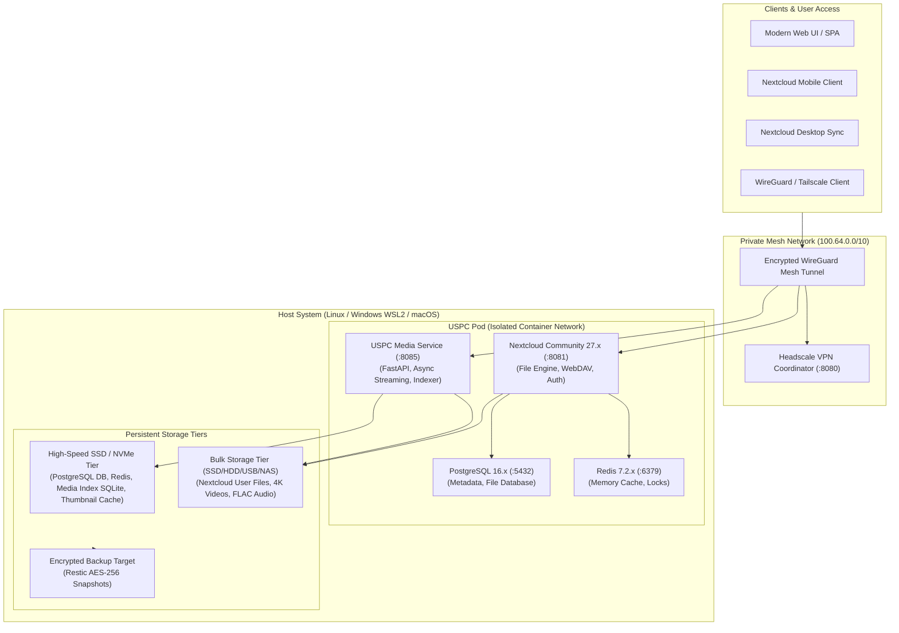
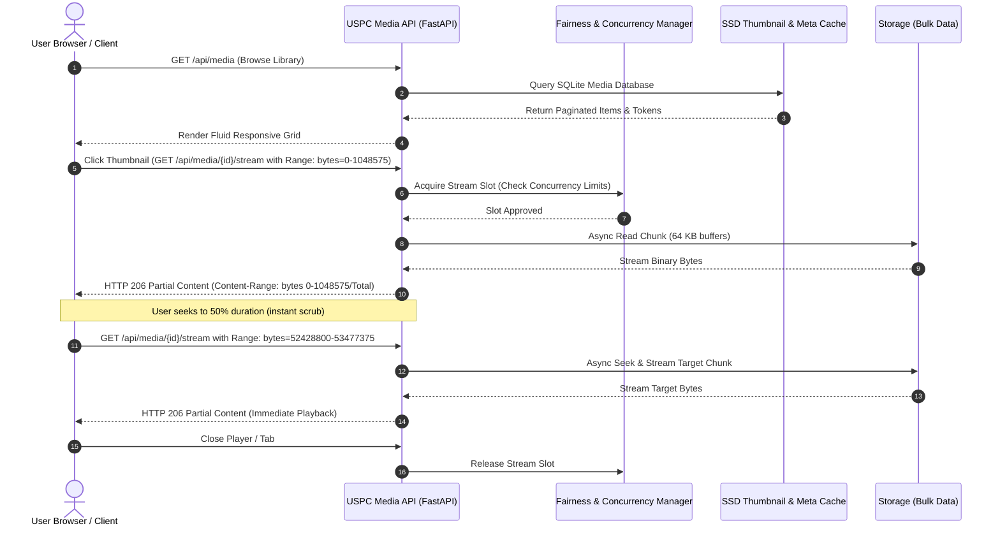

# USPC Technical Architecture Overview

The Universal Personal Cloud Platform (USPC) converts any Linux, Windows, or macOS host into a secure, vendor-independent personal cloud with integrated media streaming, encrypted backups, and private mesh networking.

## Architectural Principles

1. **Vendor-Independent & 100% Free/Open-Source**: No proprietary cloud APIs, SaaS dependencies, or mandatory subscriptions.
2. **Private-First Overlay Mesh**: Default zero public exposure via WireGuard + self-hosted Headscale.
3. **Container-Native Runtime**: Podman as primary rootless engine with Docker compatibility.
4. **Adaptive Multi-User Performance**: Automatic hardware capacity detection and resource profile selection (`TINY`, `SMALL`, `STANDARD`, `PERFORMANCE`, `MEDIA`).
5. **Non-Blocking Streaming Layer**: FastAPI asynchronous microservice with HTTP 206 Partial Content range requests, chunked file I/O, and in-flight deduplication.

---

## System Component Diagram

---

## Media Streaming & HTTP 206 Range Request Flow

---

## Hardware Resource Profiles Matrix

| Profile | Target Hardware | Max Streams | Max Per User | Max Transcode Jobs | DB Pool Size | Redis RAM | Rate Limit (RPM) |
|---|---|---|---|---|---|---|---|
| **TINY** | < 2GB RAM, 1 CPU Core | 2 | 1 | 0 (Direct stream only) | 5 | 128 MB | 120 |
| **SMALL** | 2 - 4GB RAM, 2 CPU Cores | 5 | 2 | 1 | 10 | 256 MB | 300 |
| **STANDARD** | 4 - 8GB RAM, 4 CPU Cores | 15 | 3 | 2 | 25 | 512 MB | 600 |
| **PERFORMANCE** | 8 - 16GB RAM, 6+ Cores | 40 | 5 | 4 | 50 | 1024 MB | 1200 |
| **MEDIA** | 16GB+ RAM, 8+ Cores, NVMe | 100 | 10 | 8 | 100 | 2048 MB | 2400 |
